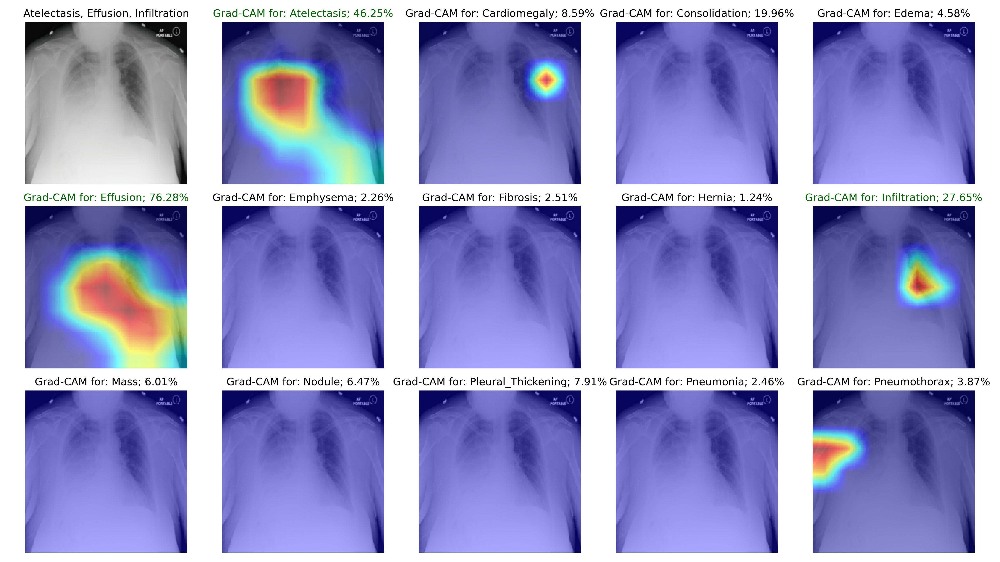

# Chest X-ray Diagnosis and Grad-CAM Visualizer

This project provides an interactive **Streamlit application** for visualizing deep learning predictions and **Grad-CAM heatmaps** on chest radiographs from the **NIH ChestX-ray14** dataset. A fine-tuned **ResNet-50** multi-label classifier is used to detect thoracic pathologies and highlight relevant image regions that contributed to each prediction.

Users can upload a chest X-ray image and:
- Receive predicted disease labels with confidence scores
- View Grad-CAM explanations for each class
- Interpret the model’s focus across a visual grid layout

---

## 🔍 Example Output



---

## Features

- Upload chest X-ray images in PNG or JPEG format
- Predict probabilities for 14 common thoracic conditions
- Visual Grad-CAM overlays for class-specific attention
- 3×5 grid display with original image and heatmaps
- Clean, responsive interface (Streamlit-based)
- Designed for local use or online deployment

---

## Model Overview

| Property        | Value                     |
|----------------|---------------------------|
| Architecture    | ResNet-50                 |
| Classification  | Multi-label (14 classes)  |
| Loss Function   | BCEWithLogitsLoss         |
| Prediction Threshold | 0.25                |
| Dataset         | NIH ChestX-ray14          |

---

## Project Structure

```
chestxray_cam_app/
├── app/
│   ├── streamlit_app.py
│   ├── model_utils.py
│   ├── cam_utils.py
│   ├── transforms.py
│   └── assets/
│       └── example_image.png
├── models/
│   ├── best_model.pth
│   └── mlb_classes.pkl
├── requirements.txt
└── README.md
```

---

## Setup Instructions

### 1. Clone the Repository

```bash
git clone https://github.com/yourusername/chestxray-cam-app.git
cd chestxray_cam_app
```

### 2. Create a Virtual Environment

```bash
python -m venv venv
source venv/bin/activate      # Linux/Mac
venv\Scripts\activate         # Windows
```

### 3. Install Dependencies

```bash
pip install -r requirements.txt
```

### 4. Launch the App

```bash
streamlit run app/streamlit_app.py
```

---

## Requirements

Key dependencies:

- `torch`, `torchvision`
- `streamlit`
- `pillow`
- `numpy`
- `matplotlib`
- `joblib`
- `pytorch-grad-cam`
- `scikit-learn` (for label binarization)

All packages can be installed via the provided `requirements.txt`.

---

## Model Weights

To run the app:

- Place your trained model file `best_model.pth` in the `models/` directory.
- Include the label binarizer (`mlb_classes.pkl`) in the same folder.

Update file paths in `streamlit_app.py` if your structure differs.

---

## Deployment

This app can be deployed on various platforms:

- [Streamlit Community Cloud](https://streamlit.io/cloud)
- [Hugging Face Spaces](https://huggingface.co/spaces)
- [Render](https://render.com/)
- Self-hosted environments

Feel free to open an issue for deployment help or optimization advice.

---

## Author

**Patrick Linke**  
GitHub: [@PatrickDdx](https://github.com/PatrickDdx)

---

## Disclaimer

This application is intended for **educational and research purposes only**. It is **not** certified for clinical use or diagnostic decision-making.

---

## Acknowledgments

- NIH Clinical Center for the ChestX-ray14 dataset
- Open-source contributors to PyTorch, Streamlit, and Grad-CAM libraries

---

## Feedback & Contributions

Contributions, issues, and feedback are welcome. If you find the project useful, please consider starring ⭐ the repository or sharing it with others interested in medical AI and interpretability.
